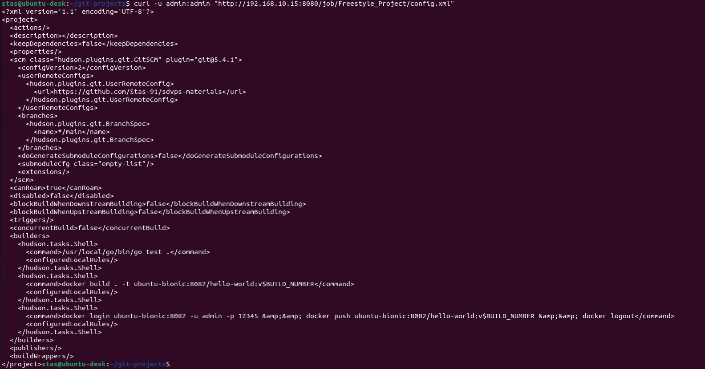
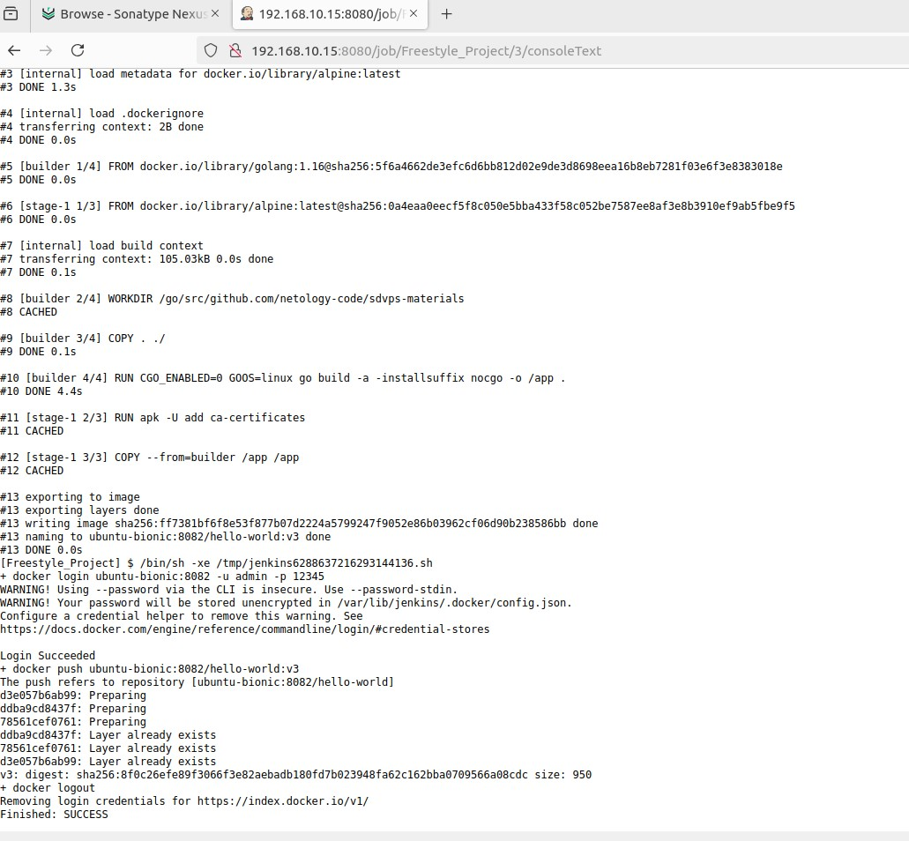
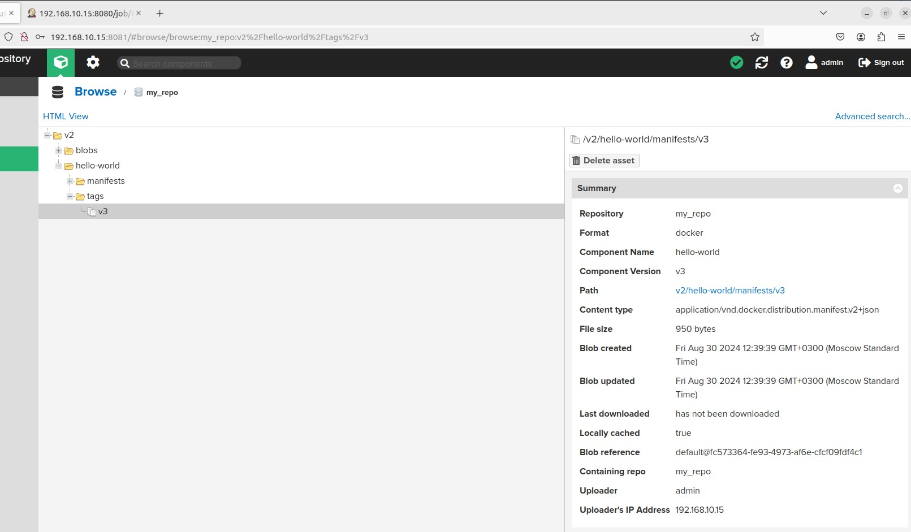
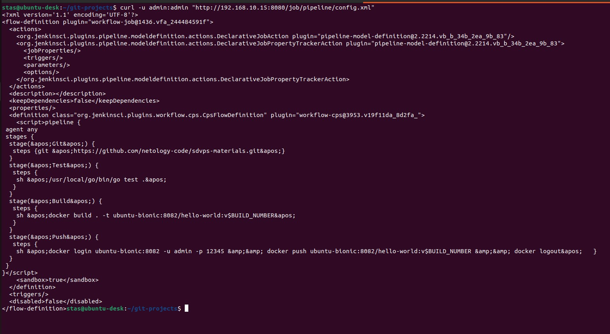
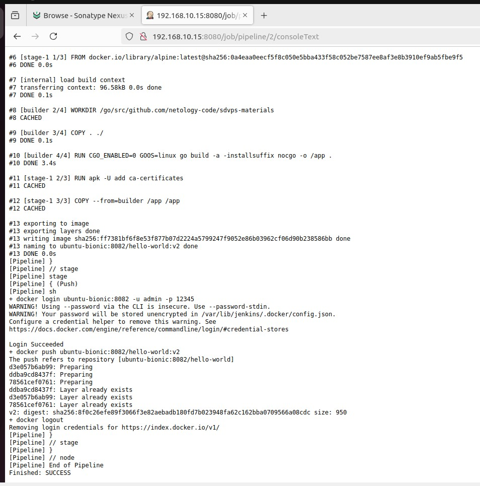
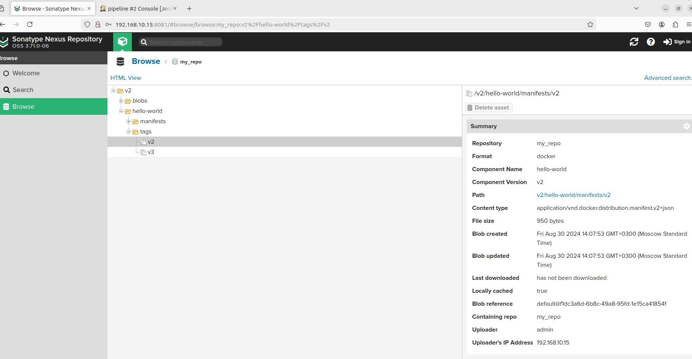
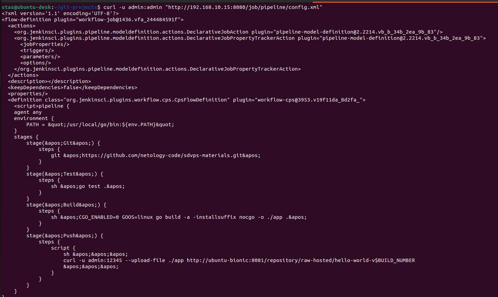
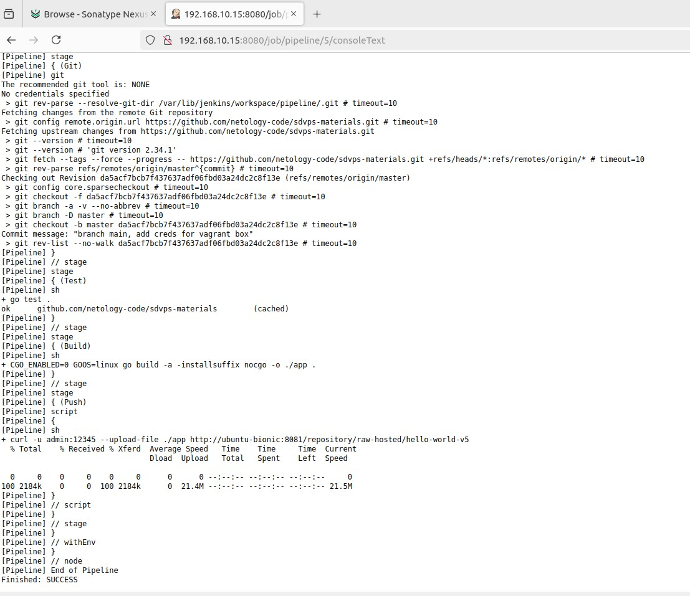
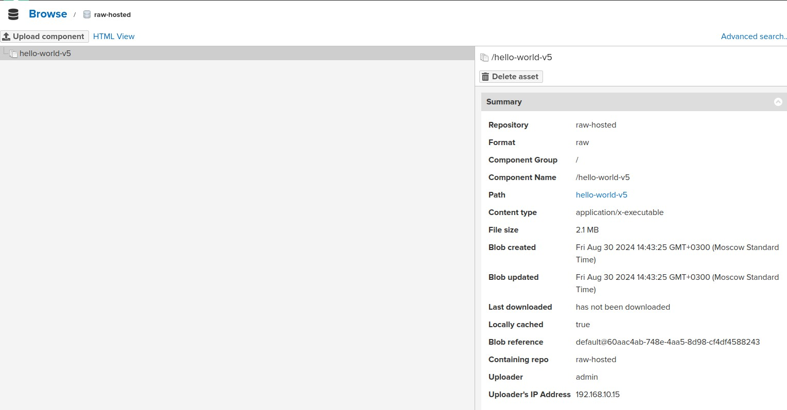

# Домашнее задание к занятию «Что такое DevOps. СI/СD» - Помельников Станислав

---

### Задание 1

Установите себе jenkins по инструкции из лекции или любым другим способом из официальной документации. Использовать Docker в этом задании нежелательно.  
Установите на машину с jenkins golang.  
Используя свой аккаунт на GitHub, сделайте себе форк репозитория. В этом же репозитории находится дополнительный материал для выполнения ДЗ.  
Создайте в jenkins Freestyle Project, подключите получившийся репозиторий к нему и произведите запуск тестов и сборку проекта go test . и docker build ..  

В качестве ответа пришлите скриншоты с настройками проекта и результатами выполнения сборки.  

### Решение 1

---

### Задание 2

**Что нужно сделать:**

Создайте новый проект pipeline.  
Перепишите сборку из задания 1 на declarative в виде кода.  

В качестве ответа пришлите скриншоты с настройками проекта и результатами выполнения сборки.  

### Решение 2

---

### Задание 3

Установите на машину Nexus.  
Создайте raw-hosted репозиторий.  
Измените pipeline так, чтобы вместо Docker-образа собирался бинарный go-файл. Команду можно скопировать из Dockerfile.  
Загрузите файл в репозиторий с помощью jenkins.  

В качестве ответа пришлите скриншоты с настройками проекта и результатами выполнения сборки.  

### Решение 3

---
## Дополнительные задания* (со звёздочкой)

Их выполнение необязательное и не влияет на получение зачёта по домашнему заданию. Можете их решить, если хотите лучше разобраться в материале.

---
### Задание 4*
Придумайте способ версионировать приложение, чтобы каждый следующий запуск сборки присваивал имени файла новую версию. Таким образом, в репозитории Nexus будет храниться история релизов.  

Подсказка: используйте переменную BUILD_NUMBER.  

В качестве ответа пришлите скриншоты с настройками проекта и результатами выполнения сборки.  

### Решение 4

